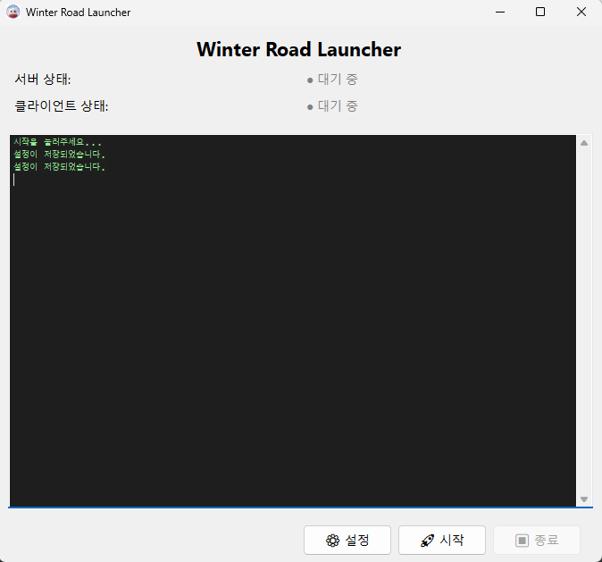
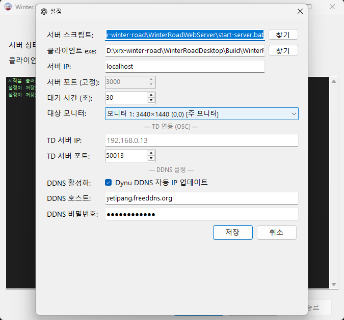

{width=7cm}

\

\

# Winter Road 운영 매뉴얼

**v0.9 — 2026.04**

엑스알엑스 (XRX Studio)

\newpage

## 1. 시스템 구성

```
[관리자 PC]
 ├─ WinterRoadLauncher              통합 진입점 (서버 + Desktop 자동 시작/종료)
 ├─ WinterRoadWebServer (Node.js)   WebSocket + WebGL 빌드 호스팅 + OSC 송신
 │    └─ UnityWebGLBuild/           WebGL 게임 정적 파일 (관람객이 도메인으로 접속하는 페이지)
 └─ WinterRoadDesktop (Unity)       메인 디스플레이 (관리자 역할)

[관람객 디바이스]
 └─ 모바일/PC 브라우저 → 관리자 PC의 WebServer가 호스팅하는 WebGL 게임

[외부 연동 — 본 매뉴얼 범위 외]
 └─ 미디어서버 (LED·영상 제어용) — WebServer가 OSC 메시지를 송신하는 대상
```

> 관리자 웹페이지(`localhost:3000` 루트)는 운영에 사용하지 않습니다.
> 모든 운영 제어는 런처와 Desktop으로만 수행합니다.

> WebGL 게임 빌드는 별도 PC에 두지 않습니다.
> 관리자 PC의 WebServer가 빌드 파일을 같이 호스팅하므로, 서버를 켜면 외부 접속 페이지도 자동으로 활성화됩니다.

\newpage

## 2. 운영 시작 절차

**런처(WinterRoadLauncher) 한 번 실행으로 서버와 Desktop이 자동 시작됩니다.**

사전점검·서버시작·디스플레이 시작은 런처 안에서 통합 처리되므로, 운영자는 런처만 다루면 됩니다.

---

### 2.1 런처 사전 설정 (최초 1회 또는 환경 변경 시)

#### 런처 실행 파일 위치

다음 경로의 실행 파일을 사용합니다:

```
xrx-winter-road\WinterRoadLauncher\publish2\WinterRoadLauncher.exe
```

처음 운영 시작 전, 바탕화면에 바로가기를 만들어두면 매번 실행이 편리합니다.

#### 런처 화면 구성

런처를 실행하면 아래와 같은 메인 창이 표시됩니다.

{width=12cm}

| 영역 | 설명 |
|------|------|
| 상단 상태 표시 | 서버 / 클라이언트의 현재 상태 (대기 중 / 시작 중 / 실행 중 / 오류) |
| 중앙 로그 영역 | 서버 출력 로그 및 시스템 메시지 |
| ⚙ 설정 | 서버 경로, 포트, OSC, DDNS 등 설정 다이얼로그 열기 |
| 🚀 시작 | 서버 + Desktop 자동 실행 |
| ⏹ 종료 | 서버와 Desktop을 함께 정상 종료 |

⚙ **설정** 버튼을 누르면 아래의 다이얼로그가 열립니다.

{width=11cm}

\newpage

#### 설정 항목

| 항목 | 값 |
|------|------|
| 서버 스크립트 경로 | `WinterRoadWebServer/start-server.bat` 의 절대 경로 |
| 클라이언트 실행 파일 | `WinterRoadDesktop.exe` 의 절대 경로 |
| 서버 IP | `localhost` (단일 PC) 또는 LAN IP |
| 서버 포트 | `3000` (고정) ⚠ |
| 로비 대기 시간 | 첫 입장 후 게임 시작까지 대기 초 ★ |
| 디스플레이 모니터 | Desktop을 띄울 모니터 선택 |
| OSC 호스트 / 포트 | 외부 미디어서버 IP / OSC 수신 포트 ★ |
| DDNS 활성화 | 외부 도메인 접속 사용 시 (체크 권장 — 아래 참고) |

설정값은 `settings.json`에 저장되어 다음 실행 때도 그대로 유지됩니다.

---

#### DDNS 설정

본 운영 환경은 외부에서 도메인 기반으로 접속할 수 있도록 **Dynu DDNS** 서비스를 사용합니다.

**서비스 계정 정보**:

| 항목 | 값 |
|------|------|
| 서비스 | Dynu DDNS (https://www.dynu.com) |
| 아이디 | isaac@xrx.studio |
| 비밀번호 | yetipang1234 |
| 도메인 (호스트) | yetipang.freeddns.org |

> **DDNS 활성화 체크는 항상 켜두는 것을 권장합니다.**
>
> **동작 원리**
>
> 체크된 상태에서 서버를 시작하면, 런처가 현재 PC의 공인 IP를 자동으로 감지하여 Dynu DDNS 서비스에 갱신 요청을 보냅니다.
> 이 과정 덕분에 외부 인터넷 IP가 변경되어도 도메인(`yetipang.freeddns.org`)으로의 접속이 끊기지 않습니다.
>
> **체크 해제 시 위험**
>
> 체크를 해제하면 IP 자동 갱신이 일어나지 않습니다.
> 운영 중 ISP에 의해 공인 IP가 바뀌면 외부에서 도메인으로 접속할 수 없게 되며, 새 IP를 수동으로 Dynu에 등록해야 복구됩니다.

\newpage

#### ⚠ 주의사항

> **★ 로비 대기 시간 동기화 주의**
>
> 런처 시작 시점에 이 값이 `WinterRoadWebServer/config.json`의 `game.lobbyDuration`을 **자동으로 덮어씁니다**.
>
> 따라서 운영 중 대기 시간을 변경하려면 반드시 런처 ⚙ 설정에서 변경하세요.
> server `config.json`을 직접 수정해도 다음 런처 시작 시 덮어써집니다.

> **★ OSC 호스트/포트 동기화 동작**
>
> ⚙ 설정창에서 **저장 버튼을 누르는 순간** `WinterRoadWebServer/config.json`의 `osc.host` / `osc.port`가 덮어씌워집니다 (`enabled` 등 다른 필드는 유지).
>
> - **OSC 호스트가 빈 값이면 스킵**됩니다 (실수로 기존 설정이 날아가는 걸 막는 안전장치).
> - 런처를 단순히 **시작**하는 것만으로는 동기화되지 않습니다. 값을 바꾸려면 반드시 ⚙ 설정 → 저장을 거쳐야 합니다.
> - server config.json을 직접 수정해도 동작합니다 (다음 런처 시작 시 덮어써지지 않음 — `lobbyDuration`과 다른 점).

> **⚠ 서버 포트(3000) 변경 주의**
>
> 서버 포트는 현재 `3000`으로 고정되어 있고, **WebGL/Desktop 빌드에 하드코딩된 값**입니다.
>
> 따라서 운영 환경에서 포트를 다른 값으로 바꿔야 할 경우 **Unity를 재빌드해야 합니다**.
> 운영자가 단독으로 변경할 수 없으니, 포트 변경이 필요한 상황이 생기면 **반드시 아래 "지원 연락처"로 먼저 연락**해주세요.

---

### 2.2 운영 전 매일 점검

- [ ] LED·디스플레이 전원
- [ ] 관리자 PC ↔ 외부 미디어서버 네트워크 연결
- [ ] 외부 미디어서버 IP가 바뀌었다면 다음 둘 중 하나로 갱신:
  - 런처 ⚙ 설정 → OSC 호스트 변경 → **저장 버튼 클릭** (server config.json에 자동 반영)
  - 또는 `WinterRoadWebServer/config.json`의 `osc.host`를 직접 수정

---

### 2.3 시작

1. `WinterRoadLauncher.exe` 실행
2. **🚀 시작** 버튼 클릭
3. 런처 화면 상태 표시 확인:
   - 서버 상태: `시작 중...` → `실행 중` (녹색)
   - 클라이언트 상태: `시작 중...` → `실행 중` (녹색)
4. 런처 로그 창에 `[Server] Server listening on port 3000` 및 `OSC connection ready` 관련 메시지 확인
5. 모바일에서 도메인 접속 → 런처 로그에 `[Server] playerHello received → request /goto_live` 출력 → LED 점등 확인

> Desktop 창이 종료되면 서버도 자동으로 같이 종료됩니다.
> 운영 중에는 Desktop을 임의로 닫지 않습니다.

\newpage

## 3. 운영 중 체크포인트

| 항목 | 정상 상태 |
|------|---------|
| 서버 콘솔 | 에러 없이 메시지 흐름 정상 |
| 외부 접속 | 새 사용자 접속 시 약 3초 트랜지션 후 LED ON |
| 게임 사이클 | lobby(30s) → playing(60s) → finished → +14s LED OFF → +20s lobby 재진입 |
| 결과창 | 플레이어 element 아이콘 정상 표시 |

---

## 4. 운영 종료 절차

1. 진행 중인 게임 종료 대기
2. 다음 중 한 가지로 종료:
   - 런처 **⏹ 종료** 버튼 클릭
   - 또는 Unity Desktop 창이 Focus된 상태에서 `ESC` 키
3. 런처 창 닫기
4. 디스플레이·LED 전원 차단

> 두 가지 방법 모두 서버와 Desktop이 함께 종료됩니다.
> 응답이 없으면 6번(비상 시 복구)의 강제 종료 절차를 사용하세요.

\newpage

## 5. 자주 발생하는 오류 대응

### A. 런처에서 시작 실패 — 서버 상태가 `오류` (빨강)로 표시됨

**자주 있는 원인**:

- 런처 설정의 **서버 스크립트 경로**가 비어있거나 잘못됨 → ⚙ 설정에서 다시 지정
- `Cannot find module 'express'` 가 로그에 보임 → `WinterRoadWebServer/`에서 `npm install` 한 번 실행
- 3000 포트가 다른 프로세스에 사용 중 → `taskkill /F /IM node.exe` 후 재시작

---

### B. 게임이 멈춤 / 응답 없음

1. 서버 프로그램을 **종료** (방법은 아래 C 참고)
2. 잠시 대기 후 런처 **🚀 시작** 으로 재시작
3. **현재 WebGL로 플레이 중인 고객이 있다면** 다음과 같이 안내:

   > "잠시 시스템을 재시작하겠습니다. 페이지를 새로고침해 주세요. 새로고침하면 게임을 이어서 진행하실 수 있습니다."

4. 고객이 새로고침하면 자동으로 닉네임 화면 또는 진행 중인 게임으로 복귀하여 재개됩니다.

---

### C. 서버 프로그램 비상 정지 / 종료 방법

다음 두 가지 방법 모두 **서버와 Desktop이 함께 종료**됩니다. 어느 쪽이든 사용 가능합니다.

| 방법 | 절차 |
|------|------|
| 런처에서 종료 | 런처 창의 **⏹ 종료** 버튼 클릭 |
| Unity Desktop에서 종료 | Desktop 창이 Focus된 상태에서 `ESC` 키 → Desktop 종료 시 서버도 자동 종료 |

비상 시에도 동일한 방법으로 종료 가능합니다.
두 방법 모두 응답이 없으면 6번(비상 시 복구)의 강제 종료 절차를 사용하세요.

\newpage

## 6. 비상 시 복구

### 런처 ⏹ 종료 / Desktop ESC 모두 응답 없음

정상 종료 방법(5번 C)이 모두 먹히지 않을 때만 사용:

```bash
taskkill /F /IM node.exe                  # 서버(Node.js) 프로세스 모두 강제 종료
taskkill /F /IM WinterRoadDesktop.exe     # Desktop 프로세스 강제 종료
```

이후 런처 다시 실행 → 🚀 시작

---

### 외부 미디어서버 영상 멈춤 / 잘못된 상태

- 런처 재시작으로 OSC idle 동기화 발사됨
- 그래도 안 되면 외부 미디어서버 측에서 수동 reset (해당 시스템 운영자에게 요청)

---

## 지원 연락처

운영 중 매뉴얼로 해결되지 않는 문제, 포트 변경처럼 빌드 작업이 필요한 상황, 또는 기타 기술 지원이 필요할 때 아래로 연락 주세요.

| 담당 | 연락처 |
|------|--------|
| 엑스알엑스 Lap | 010-5629-2406 / lap@xrx.studio |

---

## 변경 이력

- **v0.8** — 초안 작성
- **v0.9** — 런처 실행 파일 경로 명시. 런처 메인/설정 화면 이미지 및 영역 설명 추가. DDNS 설정 섹션 신설(Dynu 계정 정보 + 활성화 권장 사유 + 동작 원리). 변경 이력은 v0.8부터로 정리(이전 항목 삭제). 시작 절차에서 QR 코드 확인 항목 제거(외부 비공개 정책에 따라). 전반적인 줄바꿈·가독성 개선
